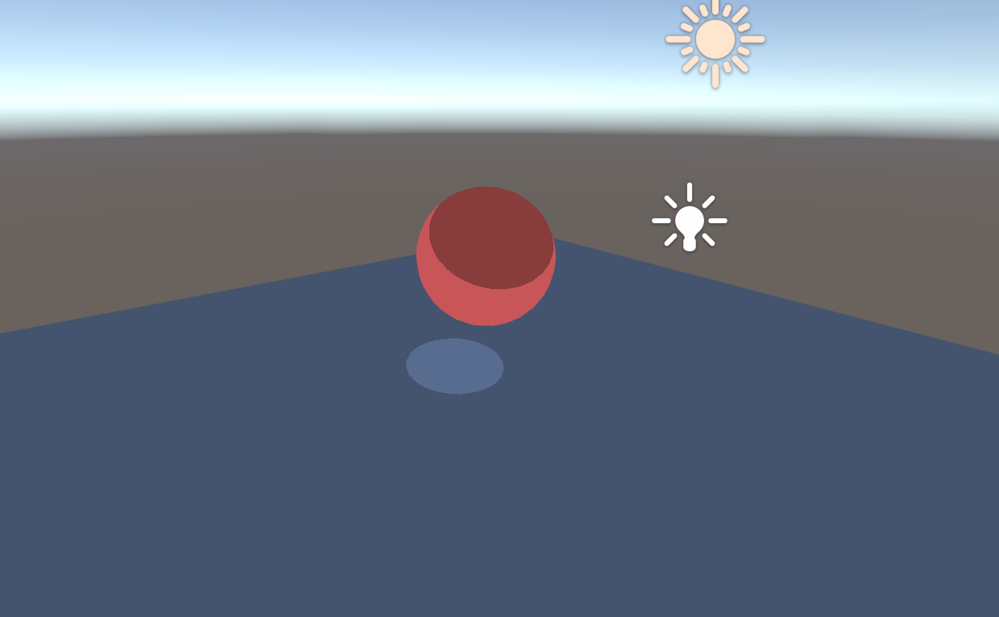
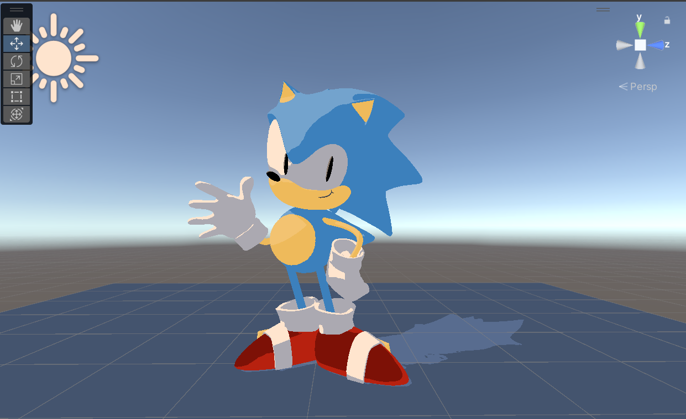
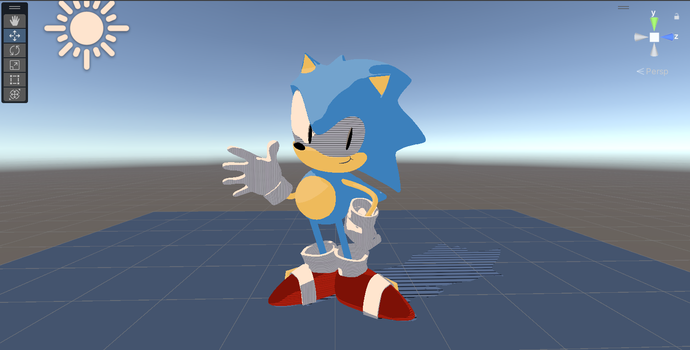

# Lab 05 - Stylization!
Let's practice adding stylization to a 3D scene using Unity's shader graph!

## Images:

## Introduction
We will be stylizing a "toon" look by creating a shader in Unity that supports shadows and multiple lights in real-time! In the process, you will gain some familiarity with Unity’s shader graph.

## What’s provided:
This tutorial video will cover the base code, and then go over the process of making a limited version of a toon shader.

Start by downloading Unity 2022.3.9f1

[Lab Overview and Puzzle 1 Tutorial Video](https://youtu.be/jc5MLgzJong)
         
## Lab Puzzles:
The goal of each puzzle will be to replicate the look of each puzzle’s image.

### 1. Puzzle 1: Simple two-tone toon shading

   * Follow the tutorial to create a 2 band toon shader, and then create multiple materials based off of the shader graph
   * Attach those materials to the objects (the sphere and plane) in the default scene "Lab Scene 1" to produce a look similar to the one above!

### 2. Puzzle 2: Leveled-up toon shading

   * Edit your materials to allow for a 3rd color in your scene, such that you have highlights, midtones, shadows on your objects. Edit your shader so that the thresholds on these values are adjustable.
   * Shade the sonic and shadow receiving plane in "Lab Scene 2" to get a look similar to the one above!

### 3. Puzzle 3: Stylized Shadow

   * Use one of the provided texture png’s in order to add a screenspace shadow pattern onto the shadows of the scene!
   * Hint 1: What does the "ShadowAttenuation" variable do?
  
Extra Credit:
 * Add some soft interpolation at the edges of your bands, for smooth transitions between color bands. Create a "smoothness" parameter that adjusts the degree of smoothness!

# Submission:
- Create a pull request against this repository
- In your readme, add screenshots of your results for Puzzles 1, 2 and 3
- Profit
